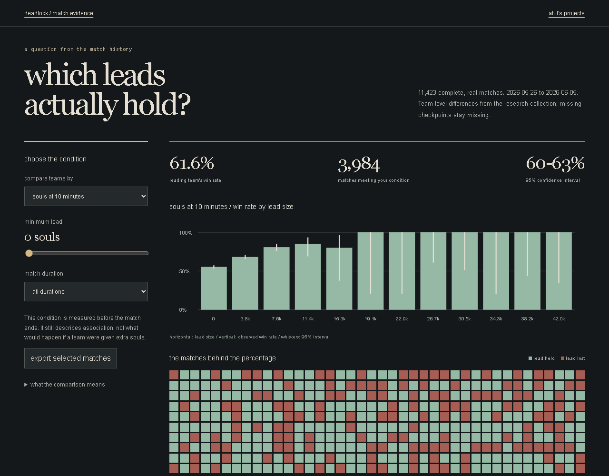

# Deadlock match analysis

**[Open the match workbench](https://lolstar123.github.io/deadlock-match-analysis/)**

11,423 complete matches from the actual collection, recorded from 26 May to 5 June 2026.
Choose a stat, set a minimum lead and compare the leading team's win rate. Select individual
matches, filter by duration, inspect confidence intervals and export the complete selected cohort.



## Questions you can investigate

- Do soul leads at 10, 15 or 20 minutes hold until the end?
- How does the relationship change with lead size or game duration?
- How strongly are hero damage, objective damage, kills, denies, healing or urn treasure associated with winning?

The checkpoint sample is smaller because unavailable observations are excluded. End-state
statistics are labelled separately: winning can itself generate the apparent advantage.
No generated matches are used. One game is one observation, rather than twelve independent
players. The 95% Wilson intervals describe sampling uncertainty, not a causal treatment effect.

## Run

```sh
python -m http.server 8000 --directory examples/portfolio
node --test examples/portfolio/model.test.mjs
pip install playwright
python -m playwright install chromium
python tools/browser_audit.py
```

| File | Purpose |
| --- | --- |
| `examples/portfolio/data/matches.json` | Anonymous team differences from actual collected records |
| `examples/portfolio/model.mjs` | Cohorts, lead classification, bins and Wilson intervals |
| `tools/export_matches.py` | Reproducible transformation from original JSONL collections |
| `tools/browser_audit.py` | Real-data load, filters, match inspection, export and mobile checks |

The public browser audit runs every four hours and after publishing. It checks the deployed
app, not just a local build. The census is a fixed historical research sample, not a live feed.
