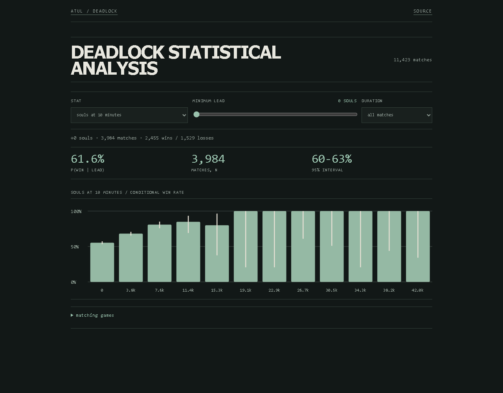

# Deadlock match analysis

[**Open the match workbench**](https://lolstar123.github.io/deadlock-match-analysis/)

Investigate conditional win rates in **11,423 complete Deadlock matches**, collected from 26 May to 5 June 2026. Choose a stat, a minimum lead and a match-duration cohort. The workbench keeps the leading team's win rate, sample size and 95% Wilson interval together.



## Try a comparison

1. Start with **souls at 10 minutes**. Change the minimum lead and watch the selected cohort change.
2. Compare 15- and 20-minute checkpoints, then restrict the match duration.
3. Expand **small cohorts** to inspect ranges with fewer than ten matches. Their original observations and intervals are retained; the display does not combine or replace bins.
4. Open **Inspect matching games**, select a match and export the complete selected cohort as CSV. The on-screen grid shows at most 400 games; the export includes every selected game.

Final net worth, hero damage, objective damage, kills, denies, healing and urn treasure are also available. The interface labels these as end-of-match associations because winning can itself increase those statistics.

## What the numbers mean

One game is one observation. A leading team is determined by the sign of the team-stat difference; tied and missing observations are excluded. A minimum lead uses the absolute difference between the two teams.

The duration cohorts are disjoint: below 25 minutes, from 25 up to 40, and 40 minutes or longer. The archive's longest match is below the model's 120-minute upper bound. Each chart bin uses every eligible match in that lead range; highlighted ranges lie wholly above the selected minimum. A bin that straddles the threshold remains visible but is not highlighted.

No generated matches are used. Wilson intervals describe sampling uncertainty. They do not correct collection bias, missing checkpoints or confounding, and these historical associations are not causal effects or live forecasts. See [data provenance](PROVENANCE.md).

## Run locally

Use Python 3 and a current browser. There is no package install or build step for the demo.

```sh
python -m http.server 8000 --directory examples/portfolio
```

Open **http://localhost:8000** from the repository directory. Serve the page over HTTP; opening the HTML file directly prevents its data fetch from working.

## Checks

Node's built-in test runner checks observation counting, Wilson intervals, the real census and duration boundaries. Python Playwright runs the browser flows in an isolated headless browser.

```sh
node --test examples/portfolio/model.test.mjs
python -m pip install playwright
python -m playwright install chromium
python tools/browser_audit.py
```

On Windows the audit uses installed Google Chrome; other platforms use Playwright Chromium. It checks filters, exports, small-cohort expansion, fixed-size plot marks, keyboard focus, empty cohorts, a failed archive load and the 390 px layout. Desktop and mobile evidence goes into ignored `output/qa/`; the README preview is refreshed from the same run.

## Code map

| File | Responsibility |
| --- | --- |
| [model.mjs](examples/portfolio/model.mjs) | Cohort selection, lead classification, empirical bins and Wilson intervals |
| [app.mjs](examples/portfolio/app.mjs) | Controls, plot rendering, match inspection and CSV export |
| [matches.json](examples/portfolio/data/matches.json) | Anonymous team differences from collected matches |
| [export_matches.py](tools/export_matches.py) | Transformation from the author's original JSONL collections |
| [browser_audit.py](tools/browser_audit.py) | Headless browser checks and screenshots |
| [DESIGN.md](DESIGN.md) | Visual decisions and verification criteria |

The export script needs the original collections described in provenance; they are not included here. The browser demo uses the bundled anonymous archive and needs no account or API key.
